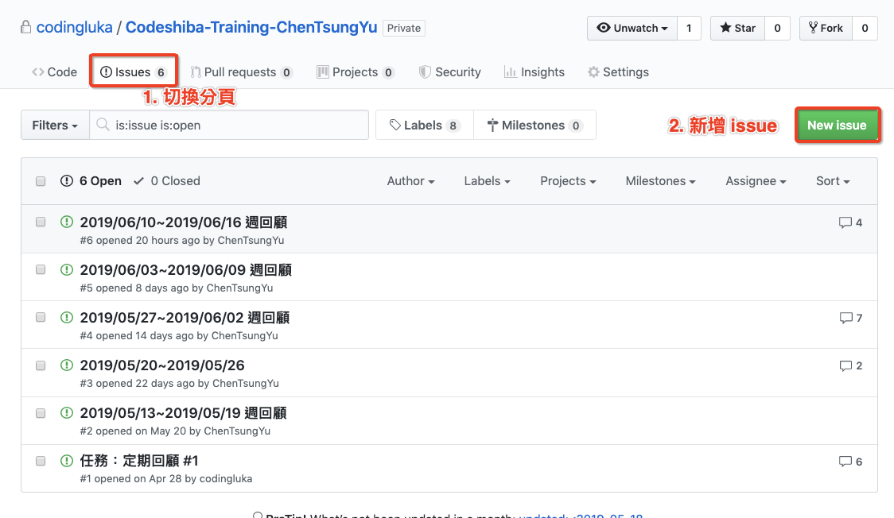
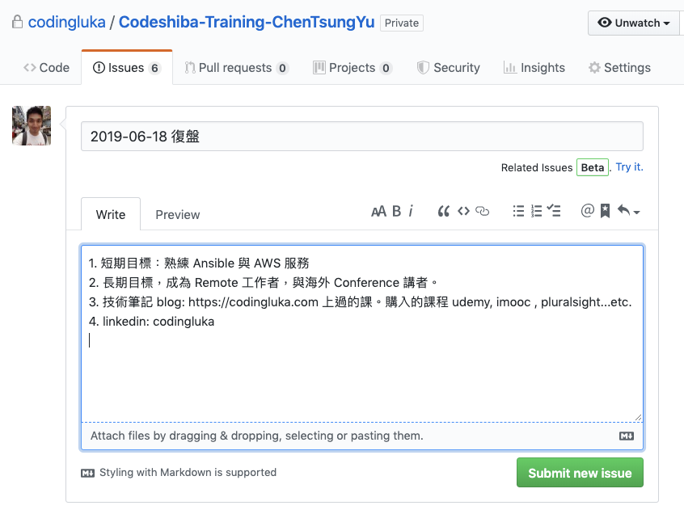
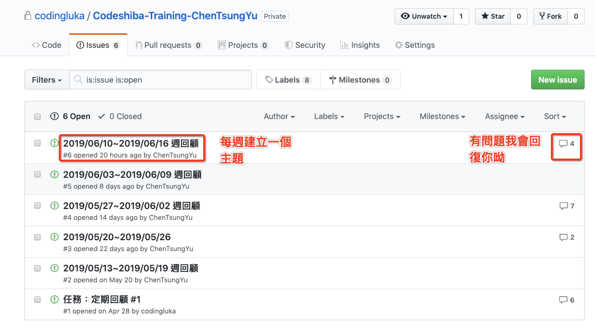

# Codeshiba 隱藏版特訓

## 個人資料

(請先更新個人資料，按下本文右上方小圖示可以編輯 並刪除本行)

- 姓名：賴柏瑜
- 主要聯絡方式：darren15943@mail2.blsh.tp.edu.tw
- 目前工作狀態：全職學習

## Codeshiba 隱藏版特訓

Hi, 我是 Luka，恭喜你開啟了 Codeshiba 隱藏版特訓。核心精神如下：

- 統整目前學習的狀況 - 先了解你目前的學習狀況，包含你之前學的東西，上過的課。
- 釐清你的目標，並看看現在距離目標還有多遠，看看哪些地方需要加強。
- 聚焦眼前的事 - 看清目標之後，與目標的距離切分成小單位的工作(專案管理軟體裡面 Task)
- 定期回顧與目標的距離，並做出調整 - 我會跟你一起回顧你目前的學習狀況，看看與目標的距離，有需要調整的地方加以改進。

## 「復盤」的意義

### 重新定位一下你的目標

我常常每隔一段時間就問自己，現在我的目標是什麼，究竟我想做什麼？
經歷了一些事情厚，想做的事情會不太一樣，不斷修正，直到找到你真正想做的事情。有一個明確的目標，你才能夠毫無顧慮的全力以赴。

### 整理一下目前你的努力

來回顧一下你目前做的努力離想要的目標還有多遠。你要做出怎麼樣的改變，或是要加強哪些地方，才能夠離目標更近一點。

常常我們忙到暈頭轉向，卻沒有發現自己已經沒有朝向目標前進，不時的檢視自己的作法，看看是不是有足夠的效益，再決定要不要執行，掌握 80 / 20 法則，做好 20%重要的事情，你就可以得到豐碩的成果。

## 開始「復盤」

### 步驟 1 - 建立一個新的 Issue

### 步驟二 - 建立第一個 Issue「 2019-06-18 復盤」

1. 你的短期目標是？
2. 你的長期目標是？
3. 列出所有的上過的課、購入的資源、學習筆記、部落格、作品集。
4. 如果你要找工作的話請讓我看看你的履歷。ps：這是私有專案只有我和你看的到

範例：

## 週回顧 - 每週回顧一次你的努力，確保有朝目標更邁進一點點

每週開一個新的 Issue

1. 你在這週做了哪些事情
2. 有沒有遇到什麼困難
3. 下週你打算做些什麼事情

範例：

透過不斷的努力與修正方向，你就能夠達到你所想要的目標，加油！🦊
